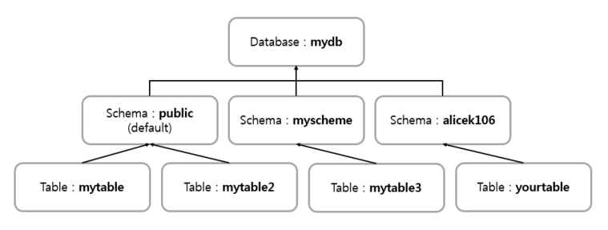
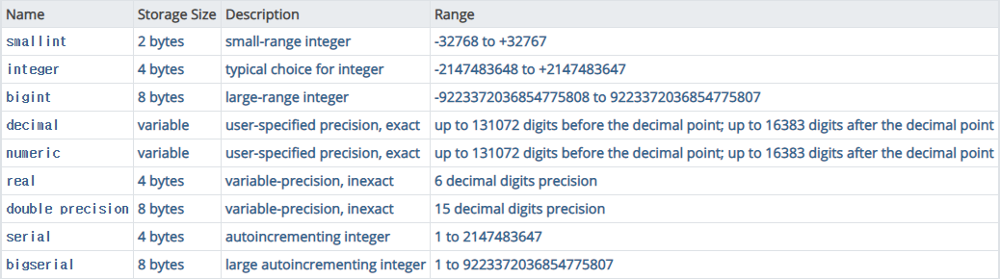
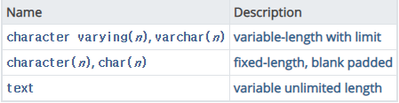
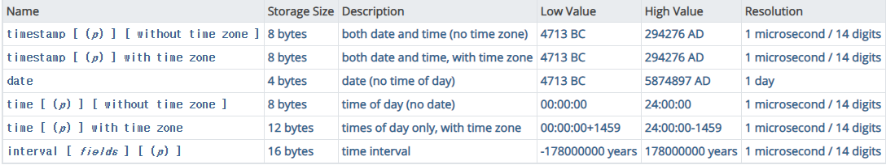
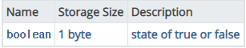

<h1 align="center" style="font-family: Georgia, 'Times New Roman', serif">PostgreSQL</h1>

* PostgreSQL은 MySQL, MariaDB와 비슷한 관계형 데이터베이스이나 사용법은 꽤 상이하다.
* PostgreSQL의 구조  
    1. Database Layer
       * 최상위 계층에 Database라는 Layer가 존재함
       * 이 Layer는 흔히 우리가 create database ... 명령어로 생성하던 것이다.
       * 이 Database Layer는 물리적으로 데이터를 구분한 것
    2. Schema Layer
       * Schema는 Database 아래에 위치한 계층
       * Database를 생성하면 기본적으로 public schema가 생성됨
       * Schema Layer는 Database 내에서 논리적으로 구분된 계층임
       * MySQL에서 사용하던 Database의 개념은 PostgreSQL의 Schema와 유사함
       * 하지만 조금 다른 점이 있다면 PostgreSQL의 Database는 데이터의 물리적 집합을 정의하기 때문에 Database 내의 Schema들은 JOIN 연산이 가능함
       * *ex)* 아래 그림에서 public schema의 mytable은 myschema의 mytable3과 JOIN 연산 가능
    3. Table
       * Schema 아래에 생성됨  
     
    

  
     

* 그렇다면, Schema가 왜 존재하느냐?
    1. 여러 사용자가 서로 충돌 없이 하나의 Database를 사용하는 것이 가능하다.
    2. Database를 여러 개의 논리적인 그룹으로 만들어 더욱 관리하기 쉽게 한다.
    3. Third-Party Application이 서로 충돌할 일 없게 다른 Schema를 사용하도록 함

* PostgreSQL 사용 방법
    * PostgreSQL version 확인 => `select version()`

    * User 목록 확인 => `\du`
        * `\du+`는 상세 조회 (Description까지 출력)  

    * User 생성 => `create role ${userName};`
        * *ex)* `create role testuser;`  

    * User 삭제 => `drop role ${userName};`
        * *ex)* `drop role testuser;`  

    * Database 목록 확인 => `\l` (소문자 L) or `\list`
        * `\lt+` or `\list+`는 상세 조회  

    * 사용하는 Database 변경 => `\c`  
        *ex)* `\c template1`  

    * Database 생성 => `create database ${databaseName}`  
        *ex)* `create database leaf;`  

    * Schema 목록 확인 => `\dn`  

    * Schema 생성 => `create schema ${schemaName}` or `create schema ${schemaName} authorization ${userName}`   
        *ex)* `create schema board` or `create schema board authorization jh`  

    * Table 목록 확인 => `\dt`
        * `\dt` 명령어는 public schema에 속한 Table만 보여준다. 정확히는 search_path에 설정된 Schema를 사용한다.
        * 특정 Schema에 속한 Table을 보려면 `\dt ${schemaName}.${tableName}`을 입력한다.   
            *ex)* 특정 Schema의 특정 Table을 보려면`\dt board.boardTable`  

* PostgreSQL의 Data Type
    * Numeric Types  
         
        

  
         
    * Character Types  
         
        

  
         
    * Date/Time Types  
         
        

  
         
    * Boolean Type  
         
        

  
         