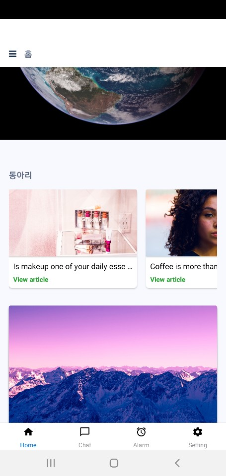
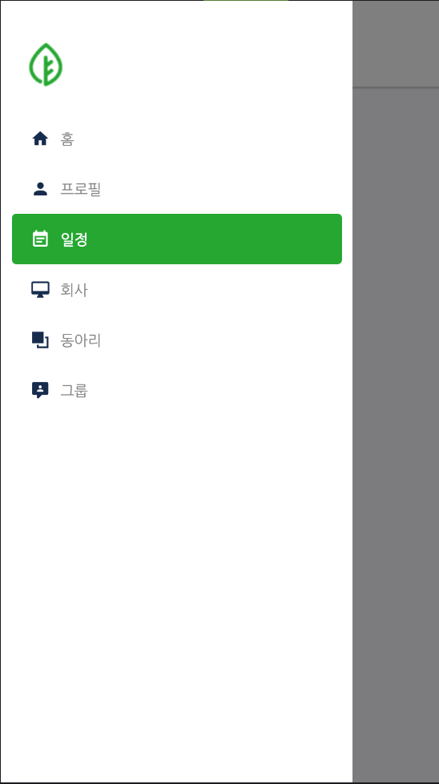
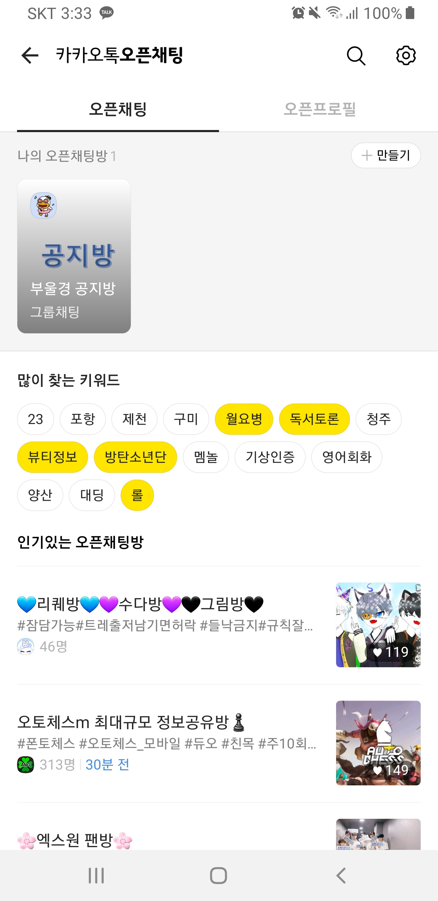

leaf 기획
==

## 기획 스토리 라인
        
1. 회원가입

        신입 홍길동은 A회사에 들어가 ERP 접속 계정을 받았다.
        
        ERP 계정은 회사 ERP프로그램 뿐만 아니라 같은 더존 ERP프로그램을 쓰는 회사들끼리 쓸수있는 SNS어플(leaf)도 이용할 수 있다고 한다.
        leaf어플은 회사 외적으로 사원들의 여가나 자기계발을 할 수 있는 스터디, 동호회, 동아리 같은 그룹을 만들수 있다고 한다.
        길동은 지급받은 계정으로 먼저 회원가입을 한다. (우리는 그런 절차가 없으므로 기본 회원가입 양식을 기준으로 틀을 짜서 만든다.)
        회원가입을 한 홍길동은 자신의 ERP 계정으로 로그인을 하여 홈페이지로 접속을 한다.

2. 홈, 구성

        처음 접속을 하니 간단한 사용방법이 있는 이미지창이 뜬다.
        보이는 이미지를 닫으니 홈페이지을 보니 회사, 동아리, 그룹 세 파트가 보인다.
    
        회사 부분엔 카드형식으로 공지사항과 일정이 우에서 좌로 넘길 수 있는 카드형식으로 떠있다.
        카드의 내용은 회사의 일정, 공지사항, 회사게시판에서 작성된 글들이 아래와 같은 카드형식으로 보여진다.

    
 </img>

        동아리와 그룹은 아무것도 가입되어있지 않아서 동아리와 그룹은 동아리에 가입하세요, 그룹에 가입하세요 라는 내용만 보인다.
        가운데 부분을 제외한 부분은 하단바와 좌측 상단에는 메뉴바가 있고 눌러보니 사이드 탭이 뜬다
        
4. 하단 바
    
 </img>

        하단바에 있는 채팅창에는 회사 채팅창이 하나 보이고 소속 부서 채팅창이 보인다.
        알림창에는 처음 가입하여 들어왔기에 회원가입을 환영한다라는 알림과 프로필을 수정하라는 알림 뿐이다.

    
5. 사이드 탭 - 홈, 프로필, 일정

    
 </img>

        사이드탭을 확인하니 방금 본 홈탭과 프로필을 설정하는 프로필탭 그리고 일정을 관리할 수 있는 일정탭이 보인다.
        프로필 탭에선 자신의 정보들을 보여주고 있었고 사진등을 설정할 수 있다.
        일정 탭에서는 회사, 동아리, 그룹에서 관리되는 일정들이 같이 보이는듯 하다. 따로 일정을 추가를 할 수 있는것 같다.

    4.
        
        그 아래에는 입사한 회사탭이 있고 탭을 눌러보니 공지사항, 일정, 겔러리, 게시판이 보인다.
        공지사항은 회사에서 ERP 프로그램으로 본 내용과 비슷한것 같다. 일정을 보니 몇몇 부서들의 회식 일정이 잡혀있는게 보인다.
        겔러리와 게시판을 보니 선임들과 타 부서 사람들이 게시한걸 볼 수 있었고 공지사항을 제외하곤 약간의 여가 정보 공유 같은 성격을 띄고 있는 듯 하다.
        그리고 공지사항 아래로 보이는 메뉴는 사내게시판과 동아리 이라는 탭이 있었으며 사내게시판에는 몇몇 선임들과 타 부서 사람들이 적어놓은 글들을 볼 수 있었고 게시글 내용 자체는 공지사항을 제외하곤 업무적이기보단 약간의 여가 정보 공유 같은 성격을 띄고 있는 듯 하다.
        
        
        5.
        다음 동아리에서는 사내에 만들어진 여러 스터디 및 동호회 등을 볼 수 있었다.
        등산, 볼링, 게임, 스프링, 알고리즘 등등 회사에서 들었던 동아리들이 보이며 그 중 스프링 스터디가 끌려서 가입을 하려 한다.
        가입신청 폼은 실명제로 이루어 지다보니 간단하였다. 이 동아리는 승인 후 가입이기에 제출을 하고 다른 기능들을 더 살펴보려 한다.
        

        마지막으로 그룹 탭을 눌러보니 오픈카톡방 찾기같은 느낌의 페이지가 보인다.

    
 </img>

        그룹 리스트에는 그룹이름과 그룹장, 그룹원 수, 즉시가입 or 승인요청, 그룹소개 가 눈에 보인다. 
        일단 부족한 지식을 채우기 위해 스프링 배우기 라는 승인요청이 필요한 사내동아리에 가입신청버튼을 눌러 그룹에서 원하는 양식을 기입 후 승인요청 버튼을 누른다.
        그러고 더 둘러보는 도중 카카오톡으로 같은 동기들끼리 비밀그룹을 만들었다며 초대코드를 받았고 코드를 입력하니 바로 그룹을 들어갈 수 있었다.
        비밀동기그룹에 보니 일정탭과 잡담탭이 있었고 일정탭에서는 벌써 이번주 주말에 동기회식이 있었다. 해당 달력을 눌러 일정참가를 누르니 처음 홈탭 밑에
        일정탭에 n표시가 생기며 참가를 하려한 동기회식이 내 일정에 추가 되었다 그와동시에 떠오른 오늘받은 일주일 업무를 입력하기로 한다.
        다시 비밀동기 탭에서 게시판을 보니 몇몇동기들이 적어놓은 글들을 확인 할 수 있었고 글을 보다보니 위에 n표시가 뜬걸 보니 채팅탭도 있길래 들어가본다.
        접속해있는 몇몇 동기끼리 자기가 들어간 부서에 대해서 말하고 있었고 잠깐 대화를 한다.
        동아리를 다 확인한 길동은 그 아래 그룹찾기탭을 눌러본다.
        그 안에선 더존ERP를 사용하는 모든 회사직원들이 자유롭게 만들며 가입할 수 있는 그룹들이 있었다.
        먼저 눈에 띄는건 내가 적은 직종에 따라 프로그래밍 정보 그룹등이 눈에 보였고
        예전부터 하고싶었던 보드게임이 혹시나 있나 센텀 보드게임을 검색창에 쳐보니 몇몇 그룹들이 보인다.
        양식을 입력후 가입신청을 하니 바로 가입이 되었다.
        
        센텀보드게임 그룹에서는 일정게시판과 겔러리, 일반게시판, 투표게시판이 있었으며 일정게시판에는
        다음주 금요일 19시에 모임이 있기에 참가버튼을 눌러 내 일정에 추가하였다.
        투표게시판에는 겨울 스키장 장소 및 날짜를 정하는 투표를 하고있었고 아직 모임을 안나가봤으니 잠시 고려하도록 한다.
        겔러리게시판에서는 이때까지 했던 모임들에 대한 사진들을 볼 수 있었고
        게시판에는 여러 잡담들을 볼 수 있었다.
        
        