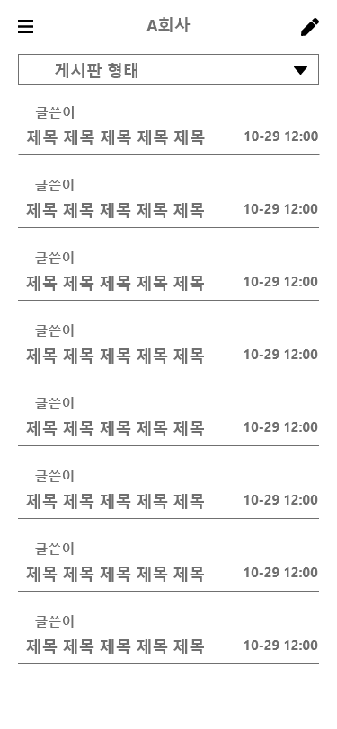
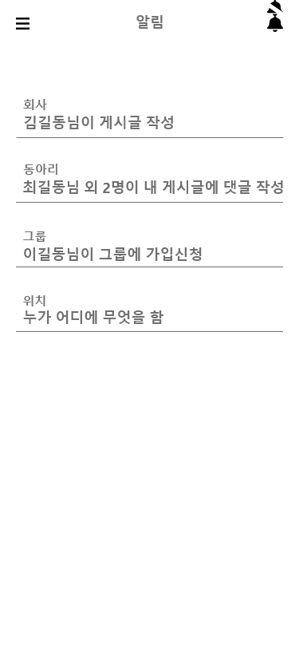

leaf 기획
==

       
    

## 기획 스토리 라인
    

1. 회원가입

        신입 홍길동은 A회사에 들어가 ERP 접속 계정을 받았다.
        
        ERP 계정은 회사 ERP프로그램 뿐만 아니라 같은 더존 ERP프로그램을 쓰는 회사들끼리 쓸수있는 SNS어플(leaf)도 이용할 수 있다고 한다.
        leaf어플은 회사 외적으로 사원들의 여가나 자기계발을 할 수 있는 스터디, 동호회, 동아리 같은 그룹을 만들수 있다고 한다.
        길동은 지급받은 계정으로 먼저 회원가입을 한다. (우리는 그런 절차가 없으므로 기본 회원가입 양식을 기준으로 틀을 짜서 만든다.)
        회원가입을 한 홍길동은 자신의 ERP 계정으로 로그인을 하여 홈페이지로 접속을 한다.
    

    
    
    

    

    
    
    

2. 홈, 구성

        처음 접속을 하니 간단한 사용방법이 있는 이미지창이 뜬다.
        보이는 이미지를 닫으니 홈페이지을 보니 회사, 동아리, 그룹 세 파트가 보인다.
    
        회사 부분엔 카드형식으로 공지사항과 일정이 우에서 좌로 넘길 수 있는 카드형식으로 떠있다.
        카드의 내용은 회사의 일정, 공지사항, 회사게시판에서 작성된 글들이 아래와 같은 카드형식으로 보여진다.

    
 </img>

        동아리와 그룹은 아무것도 가입되어있지 않아서 동아리와 그룹은 동아리에 가입하세요, 그룹에 가입하세요 라는 내용만 보인다.
        가운데 부분을 제외한 부분은 하단바와 좌측 상단에는 메뉴바가 있고 눌러보니 사이드 탭이 뜬다
        
3. 하단 바
    

        하단바에 있는 채팅창에는 회사 채팅창이 하나 보이고 소속 부서 채팅창이 보인다.
        알림창에는 처음 가입하여 들어왔기에 회원가입을 환영한다라는 알림과 프로필을 수정하라는 알림 뿐이다.
    
 </img>

    
4. 사이드 탭 - 홈, 프로필, 일정

    

        사이드탭을 확인하니 방금 본 홈탭과 프로필을 설정하는 프로필탭 그리고 일정을 관리할 수 있는 일정탭이 보인다.
        프로필 탭에선 자신의 정보들을 보여주고 있었고 사진등을 설정할 수 있다.
        일정 탭에서는 회사, 동아리, 그룹에서 관리되는 일정들이 같이 보이는듯 하다. 따로 일정을 추가를 할 수 있는것 같다.
    
 </img>

5. 회사
        
        그 아래에는 입사한 회사탭이 있고 탭을 눌러보니 공지사항, 일정, 겔러리, 게시판이 보인다.
        공지사항은 회사에서 ERP 프로그램으로 본 내용과 비슷한것 같다. 일정을 보니 몇몇 부서들의 회식 일정이 잡혀있는게 보인다.
        겔러리와 게시판을 보니 선임들과 타 부서 사람들이 게시한걸 볼 수 있었고 공지사항을 제외하곤 약간의 여가 정보 공유 같은 성격을 띄고 있는 듯 하다.
        그리고 공지사항 아래로 보이는 메뉴는 사내게시판과 동아리 이라는 탭이 있었으며 사내게시판에는 몇몇 선임들과 타 부서 사람들이 적어놓은 글들을 볼 수 있었고 게시글 내용 자체는 공지사항을 제외하곤 업무적이기보단 약간의 여가 정보 공유 같은 성격을 띄고 있는 듯 하다.
        

    

    
    
    
    

    
        
6. 사내동아리 , 그룹

        다음 동아리에서는 사내에 만들어진 여러 스터디 및 동호회 등을 볼 수 있었다.
        등산, 볼링, 게임, 스프링, 알고리즘 등등 회사에서 들었던 동아리들이 보이며 그 중 스프링 스터디가 끌려서 가입을 하려 한다.
        가입신청 폼은 실명제로 이루어 지다보니 가입버튼 하나로 들어갈 수 있을정도로 간단하였다. 
        
    

    
    
    
    

        가입한 후 동아리 페이지로 들어가니 회사 페이지에서 보인것과 다른건 없었다.
        간단하게 새로 들어온 신입이라고 소개하기위해 글을 작성한다.
        그룹탭도 사내동아리탭과 비교해서 더 많은 그룹이 있다는것 말곤 없었다.

7. 동아리, 그룹 생성

        평소 보드게임에 관심이 생겨 그룹을 만들어 운영해보려 한다.
        그룹 생성버튼을 누르고 그룹명과 그룹을 찾을 수 있는 키워드를 설정하고 생성버튼을 누른다. 대표가 될만한 사진은 등록할 수 있고 아니면 기본 사진으로 그림 하나가 들어가는 듯 하다.
        생성된 그룹에 새로운 게시판을 만들고 세팅하기 위해 하단에 설정탭을 눌러본다.
        
        그룹원일땐 보이지 않던 그룹관리 버튼이 보이고 눌러보니 게시판을 만들고 인원을 관리하는 창이 보인다.

        자유게시판, 모임 후 올릴 갤러리게시판, 모임을 정할 달력게시판을 만들고 기다리기위해 어플을 끈다.

    

    
    
    
    

        
8. 알림

        잠시 다른걸 하고 있으니 폰에서 알림이 떠있다.
        회사 게시판에 누군가가 글을 작성했고, 사내동아리 게시판에 쓴 내 게시글에 댓글이 달린게 뜨고, 내가 만든 그룹에 누군가 가입신청한게 보인다. 우측 상단 버튼으로 알림을 잠시 꺼두기로 한다.
    
    
 

## 사용할 기술
### front : react-native expo
### back : AWS-EC2 Spring-boot, JWT, security, JPA
### Database : postgreSQL, mongoDB, AWS-RDS, AWS-S3